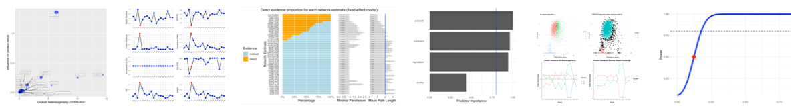

[](https://zenodo.org/badge/latestdoi/152492192)
[](https://img.shields.io/maintenance/yes/2020)
[](https://www.tidyverse.org/lifecycle/#maturing)
[](https://img.shields.io/github/last-commit/MathiasHarrer/dmetar)


<br></br>
<br></br>

<br></br>
<br></br>
<br></br>
<br></br>

## dmetar

**Doing Meta-Analysis in R**




<br></br>

The **dmetar** package serves as the companion R package for the guide [**Doing Meta-Analysis in R**](https://bookdown.org/MathiasHarrer/Doing_Meta_Analysis_in_R/) by Mathias Harrer, Pim Cuijpers, Toshi Furukawa and David Daniel Ebert. The package contains utility functions to facilitate the conduction of meta-analyses using the **meta**, **metafor**, **netmeta** and **gemtc** packages.

<br></br>

## Installation

The latest development version can be installed from **GitHub** using [**remotes**](https://remotes.r-lib.org/).

```{r, eval=FALSE}
if (!require("remotes")) {
  install.packages("remotes")
}
remotes::install_github("MathiasHarrer/dmetar")
```

<br></br>

## Learning More

The **dmetar** package was developed for the online guide **Doing Meta-Analysis in R** by Mathias Harrer, Pim Cuijpers, Toshi Furukawa and David Daniel Ebert. This guide gives an introduction on how meta-analyses can be conducted in R, with a focus on biomedical and psychological research. 

The guide was designed to serve as a low-threshold entry point for researchers who want to learn about meta-analysis using R. **No prior knowledge of R or RStudio is required**. The guide provides a more detailed overview of **dmetar** functions and how they can be used in combination with go-to meta-analysis packages such as **metafor** or **meta**.

[**View the Guide**](https://bookdown.org/MathiasHarrer/Doing_Meta_Analysis_in_R/)

<br></br>

## Questions & Bugs

For questions concerning the **dmetar** package, or to report bugs, please contact **Mathias** (mathias.harrer@fau.de). 


