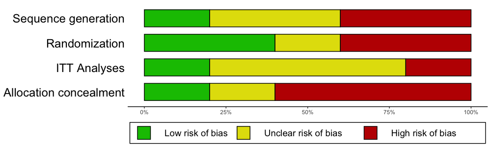
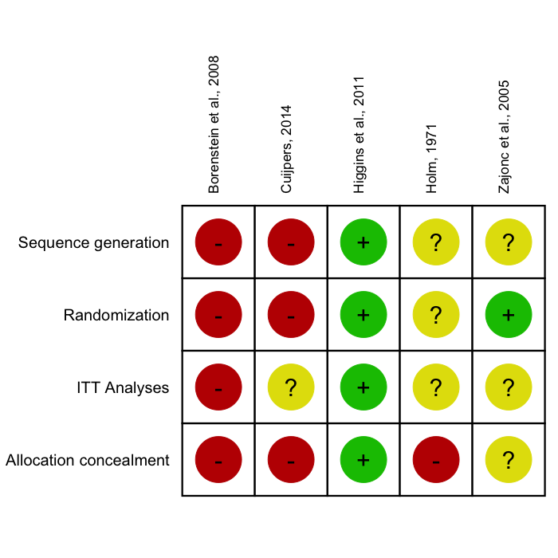
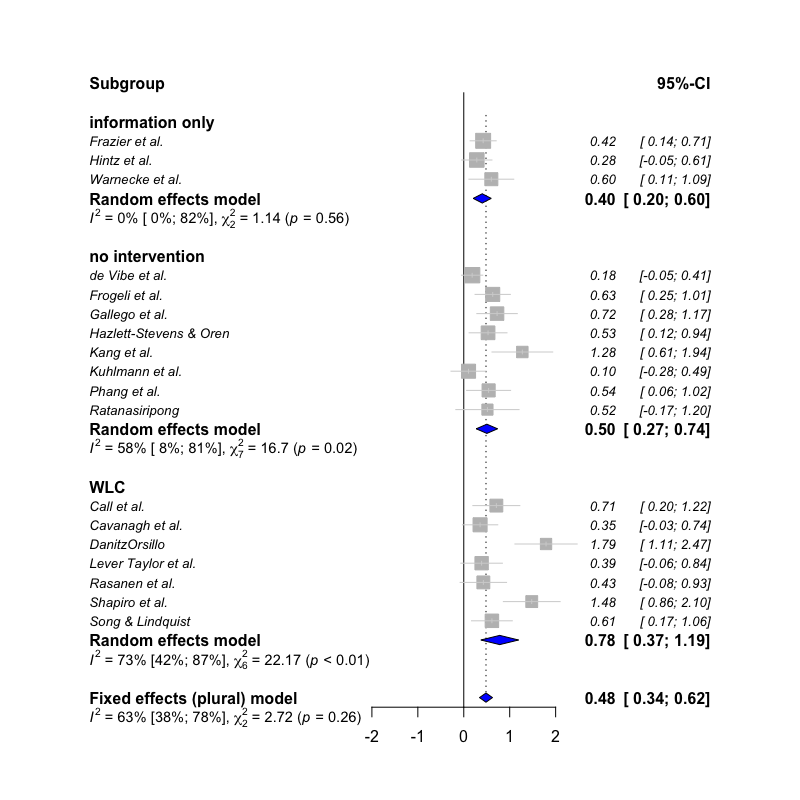
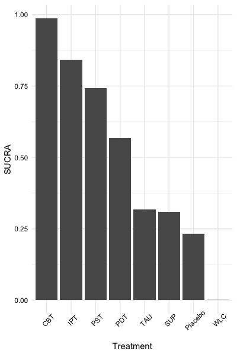

```{r setup, include=FALSE}
knitr::opts_chunk$set(echo = TRUE)
```


<br></br>

<br></br>

<br></br>

<br></br>

<br></br>

<br></br>

## About `dmetar`

The `dmetar` package serves as the companion *R* package for the online guide [**Doing Meta-Analysis in R - A Hands-on Guide**](https://bookdown.org/MathiasHarrer/Doing_Meta_Analysis_in_R/) written by Mathias Harrer, Pim Cuijpers, Toshi Furukawa and David Ebert. This freely available guide shows how to perform meta-analyses in *R* from scratch with no prior *R* knowledge required. The guide, as well as the `dmetar` package, have a focus on biomedical and psychological research synthesis, but methods are applicable to other research fields too. The guide primarily focuses on two widely used packages for meta-analysis, `meta` (Schwarzer, 2007) and `metafor` (Viechtbauer, 2010), and how they can be applied in real-world use cases. The `dmetar` package thus aims to provide additional tools and functionalities for researchers conducting meta-analyses using these packages and the Doing Meta-Analysis in R guide.

In this vignette, we provide a rough overview of the core functionalities of the package. An in-depth introduction into the package and how its functions can be applied to "real-world" meta-analyses can be found in the online version of the guide. To get detailed documentation of specific functions, you can consult the `dmetar` [reference page](https://dmetar.protectlab.org/reference/index.html).

Currently, the `dmetar` package is still under development (version 0.0.9000). This means that, despite intense testing, we cannot guarantee that functions will work as intended under all circumstances and for all environments used. To report a bug, or ask a question, please contact **Mathias** (mathias.harrer@fau.de) or **David** (d.d.ebert@vu.nl)

<br></br>

<br></br>


## Installation

Given that `dmetar` is currently under development, the package is only available from [**GitHub**](https://github.com/MathiasHarrer/dmetar) right now. To install the development version, you can use the
`install_github` function from the [`devtools`](https://www.rstudio.com/products/rpackages/devtools/) package. Given that the package already passes the `R CMD Check`, we aim to submit the package to *CRAN* in the near future after the development process has been completed.

**Use the code below to install the package:**

```{r eval=FALSE}
if (!require("devtools")) {
  install.packages("devtools")
}
devtools::install_github("MathiasHarrer/dmetar")
```

The package can then be loaded as usual using the `library()` function.

```{r, echo=FALSE, message=FALSE, warning=FALSE}
devtools::load_all()
```

```{r}
library(dmetar)
```

<br></br>

### Installation Errors


The `dmetar` package requires that *R* Version 3.6.3 or greater is installed and used in RStudio. You can check your current *R* version by running:

```{r, eval=FALSE}
R.Version()$version.string
```

If you have an *R* version below 3.6.3 installed, installing `dmetar` will likely cause an error (e.g, because the dependency `metafor` was not found). This means that you have to update *R*. A tutorial on how to update *R* on your system can be found [here](https://www.linkedin.com/pulse/3-methods-update-r-rstudio-windows-mac-woratana-ngarmtrakulchol/).


<br></br>

## Functionality

The `dmetar` package provides tools for different stages of the meta-analysis process. Functions cover topics such as power analysis, effect size calculation, small-study effects, publication bias, meta-regression, subgroup analysis, risk of bias assessment, and network meta-analyses. Many `dmetar` functions heavily interact with functions from the `meta` and `metafor` package to improve the work flow when conducting meta-analysis. Therefore, the `meta` and `metafor` package should be loaded from the library first.

```{r, echo=FALSE, message=FALSE, warning=FALSE}
library(meta)
library(metafor)
```

```{r, eval=FALSE}
library(meta)
library(metafor)
```

<br></br>

<br></br>

## Datasets

To show some of the core functionality of the `dmetar` package, we will use three datasets which come shipped with the package itself: `ThirdWave`, `MVRegressionData` and `NetDataNetmeta`.

```{r}
data("ThirdWave")
data("MVRegressionData")
data("NetDataNetmeta")
```

<br></br>

<br></br>

## Power Analysis

The `dmetar` package contains two functions for *a priori* [power analyses](https://bookdown.org/MathiasHarrer/Doing_Meta_Analysis_in_R/power-analysis.html) of a meta-analysis: [`power.analysis`](https://dmetar.protectlab.org/reference/power.analysis.html) and [`power.analysis.subgroups`](https://dmetar.protectlab.org&/reference/power.analysis.subgroup.html). Let us assume that researchers expect to have approximately 18 studies in their meta-analysis, with moderate between-group heterogeneity and about 50 participants per arm and study. Will there be sufficient power to detect an assumed minimally important difference of $d=0.18$? The `power.analysis` function can be used to answer this question.

```{r, fig.align='center'}
power.analysis(d = 0.18, k = 18, n1 = 50, n2 = 50, heterogeneity = "moderate")
```

<br></br>

<br></br>

## Effect Size Calculation

The `dmetar` package includes several functions to calculate effect sizes needed for meta-analyses: [`NNT`](https://dmetar.protectlab.org/reference/NNT.html), [`se.from.p`](https://dmetar.protectlab.org/reference/se.from.p.html) and [`pool.groups`](https://dmetar.protectlab.org/reference/pool.groups.html).

Using the `NNT` function, we can calculate the number needed to treat $NNT$ for the first effect size in `ThirdWave` ($g$=0.71). In this example, we use Furukawa's method (Furukawa & Leucht, 2011), assuming a control group event
ratio (`CER`) of 0.2

```{r}
NNT(0.71, CER = 0.2)
```

We can also pool together two groups of a study into one group using the `pool.groups` function once we have obtained the $n$, mean and SD of each arm. This can be helpful if we want to avoid a [unit-of-analysis error](https://handbook-5-1.cochrane.org/chapter_9/9_3_1_unit_of_analysis_issues.htm). Here is an example:

```{r}
pool.groups(n1 = 50, n2 = 65, m1 = 12.3, m2 = 14.8, sd1 = 2.45, sd2 = 2.89)
```

When extracting effect size data, studies sometimes only report an effect size of interest, and its $p$-value. To pool effect sizes using functions such as the [`metagen`](https://www.rdocumentation.org/packages/meta/versions/4.9-6/topics/metagen) function, however, we need some dispersion measure (e.g., $SE$, $SD$ or the variance). The `se.from.p` function can be used to calculate the standard error ($SE$), which can the be used directly for pooling using, for example, the `metagen` function. Here is an example assuming an effect of $d=0.38$, a $p$-value of $0.0456$ and a total $N$ of $83$:

```{r}
se.from.p(effect.size = 0.38, p = 0.0456, N = 83)
```

<br></br>

<br></br>

## Risk of Bias

In biomedical literature, it is common to assess the Risk of Bias of included studies using the [**Cochrane Risk of Bias Tool**](https://handbook-5-1.cochrane.org/chapter_8/8_assessing_risk_of_bias_in_included_studies.htm). Such Risk of Bias assessments can be directly performed in [RevMan](https://community.cochrane.org/help/tools-and-software/revman-5), but this comes with certain drawbacks: RevMan graphics are usually of lower quality, and journals often require high-resolution charts and plots; using RevMan along with *R* to perform a meta-analysis also means that two programs have to be used, which may consume unnecessary extra time; lastly, using RevMan to generate Risk of Bias summary plots also reduces the reproducibility of your meta-analysis if you decide to make all your other *R* analyses fully reproducible using tools such as [**RMarkdown**](https://rmarkdown.rstudio.com/). 

The [`rob.summary`](https://dmetar.protectlab.org/reference/rob.summary.html) function allows you to generate RevMan-style Risk of Bias charts based on `ggplot2` graphics directly in *R* from a *R* data frame. Here is an example:

```{r, echo=FALSE}
data = data.frame(
       "study" = c("Higgins et al., 2011", "Borenstein et al., 2008", "Holm, 1971",
                   "Zajonc et al., 2005", "Cuijpers, 2014"),
       "Allocation_concealment" = c("Low", "High", "High", "Unclear", "High"),
       "Randomization" = c("Low", "High", "Unclear", "Low", "High"),
       "Sequence_generation" = c("Low", "High", "Unclear", "Unclear", "High"),
       "ITT.Analyses" = c("Low", "High", "Unclear", "Unclear", "Unclear"),
       "Selective_outcome_reporting" = c("Low", "High", "High", "High", "Unclear")
       )
studies = data$study
data = data[,2:5]
```

```{r, eval=FALSE}
rob.summary(data, studies = studies, table = TRUE)
```




```{r, echo=FALSE, out.width = '70%', fig.align="center"}

```


<br></br>

<br></br>

## Subgroup Analysis & Meta-Regression

The `dmetar` package contains two functions related to the topic of **moderator variables** of meta-analysis results: [`subgroup.analysis.mixed.effects`](https://dmetar.protectlab.org/reference/subgroup.analysis.mixed.effects.html) and [`multimodel.inference`](https://dmetar.protectlab.org/reference/multimodel.inference.html).

<br></br>

**Mixed-Effects Subgroup Analysis**

The first function, `subgroup.analysis.mixed.effects` performs a subgroup analysis using a mixed-effects model (fixed-effects plural model; Borenstein & Higgins, 2013), in which subgroup effect sizes are pooled using a random-effects model, and subgroup differences are assessed using a fixed-effect model. The function was built as an additional tool for meta-analyses generated by `meta` functions. In this example, we therefore perform a meta-analysis using the `metagen` function first.

```{r}
meta <- metagen(TE, seTE, 
                data = ThirdWave, 
                studlab = ThirdWave$Author, 
                comb.fixed = FALSE, 
                method.tau = "PM")
```

We can then use this `meta` object called `meta` as input for the function, and only have to specify the subgroups coded in the original data set we want to consider.

```{r, eval=FALSE}
subgroup.analysis.mixed.effects(x = meta, 
                                subgroups = ThirdWave$TypeControlGroup)
```

```{r, echo=FALSE}
subgroup.analysis.mixed.effects(x = meta, subgroups = ThirdWave$TypeControlGroup)
```

```{r, echo=FALSE, out.width = '70%', fig.align="center"}

```


<br></br>

**Multimodel Inference**


The `multimodel.inference` function, on the other hand, can be used to perform [**Multimodel Inference**](https://dmetar.protectlab.org/reference/multimodel.inference.html#details) for a meta-regression model.

Here is an example using the `MVRegressionData` dataset, using `pubyear`, `quality`, `reputation` and `continent` as predictors:


```{r, fig.align="center", fig.width=5, fig.height=1.5}
library(metafor)
multimodel.inference(TE = 'yi', seTE = 'sei', data = MVRegressionData,
                           predictors = c('pubyear', 'quality',
                                          'reputation', 'continent'))
```

<br></br>

<br></br>

## Outlier Detection

To obtain a more robust estimate of the pooled effect size, especially when the between-study heterogeneity of a meta-analysis is high, it can be helpful to search for **outliers** and recalculate the effects when excluding them.

The `find.outliers` function automatically searches for outliers (defined as studies for which the 95%CI is outside the 95%CI of the pooled effect) in your meta-analysis and recalculates the results without these outliers. The function works for meta-analysis objects created with functions of the `meta` package as well as the `rma.uni` function in `metafor`. 

```{r, fig.height=6}
meta <- metagen(TE, seTE, 
                data = ThirdWave, 
                studlab = ThirdWave$Author,
                method.tau = "SJ",
                comb.fixed = FALSE)

find.outliers(meta)
forest(find.outliers(meta), col.study = "blue")
```

<br></br>

<br></br>


## Influence Analysis

Influence Analysis can be helpful to detect studies which: 

* contribute highly to the between-study heterogeneity found in a meta-analysis (e.g., outliers) and could therefore be excluded in a sensitivity analysis, or
* have a large impact on the pooled effect size of a meta-analysis, meaning that the overall effect size may change considerably when this one study is removed.

The [`InfluenceAnalysis`](https://dmetar.protectlab.org/reference/InfluenceAnalysis.html) is a wrapper around several influence analysis function included in the `meta` and `metafor` package. It provides four types of influence diagnostics in one single plot. The function works for meta-analysis objects created by `meta` functions, which can then be directly used as input for the function:

```{r, fig.width=10, fig.height=8}
infan = InfluenceAnalysis(meta)
plot(infan)
```

<br></br>

Additionally, the [`gosh.diagnostics`](https://dmetar.protectlab.org/reference/gosh.diagnostics.html) can be used to analyze influence patterns using objects generated by `metafor`s `gosh` function. The `gosh.diagnostics` function uses unsupervised learning algorithms to determine effect size-heterogeneity patterns in the meta-analysis data. We can use `dmetars` in-built `m.gosh` data set, which has been generated using `metafor`s `gosh` function as an example:

```{r, eval = T}
data("m.gosh")
res <- gosh.diagnostics(m.gosh)

summary(res)
plot(res)
```


<br></br>

<br></br>

## Publication Bias

The package contains two functions to assess the potential presence of publication bias in a meta-analysis: [`eggers.test`](https://dmetar.protectlab.org/reference/eggers.test.html) and [`pcurve`](https://dmetar.protectlab.org/reference/eggers.test.html). Both methods are optimized for conducting meta-analyses using the `meta` package, and only have to be provided with a `meta` meta-analysis results object.

<br></br>

**Here is an example output for** `eggers.test`**:**

```{r}
eggers.test(meta)
```

<br></br>

**And here for** `pcurve`**:**

```{r, fig.width=6, fig.height=6, fig.align="center"}
pcurve(meta)
```


<br></br>

<br></br>

## Network Meta-Analysis

The package contains two utility functions for network meta-analysis using the `gemtc` (Van Valkenhoef & Kuiper, 2016) and `netmeta` (Rücker, Krahn, König, Efthimiou & Schwarzer, 2019) packages.

The first one, [`direct.evidence.plot`](https://dmetar.protectlab.org/reference/direct.evidence.plot.html) creates a plot for the direct evidence proportion of comparisons included in a network meta-analysis model and displays diagnostics proposed by König, Krahn and Binder (2013). It only requires a network meta-analysis object created by the `netmeta` function as input. We will use `dmetar`s in-built `NetDataNetmeta` dataset for this example:

```{r, eval=FALSE}
library(netmeta)

data("NetDataNetmeta")

nmeta = netmeta(TE, seTE, treat1, treat2, 
                  data=NetDataNetmeta, 
                  studlab = NetDataNetmeta$studlab)

direct.evidence.plot(nmeta)
```

```{r, echo=FALSE, fig.align="center"}
knitr::include_graphics("fig/directevidence.png")
```

<br></br>

The second, [`sucra`](https://dmetar.protectlab.org/reference/sucra.html), calculates the $SUCRA$ for each treatment when provided with a `mtc.rank.probability` network meta-analysis results object, or a matrix containing rank probabilities. In this example, we will use `dmetar`s in-built `NetDataGemtc` data set.

```{r, eval=FALSE}
library(gemtc)

data("NetDataGemtc")

# Create Network Meta-Analysis Model
network = mtc.network(data.re = NetDataGemtc)

model = mtc.model(network, linearModel = "fixed",
                   n.chain = 4,
                   likelihood = "normal",
                   link = "identity")

mcmc = mtc.run(model, n.adapt = 5000, 
               n.iter = 100000, thin = 10)

rp = rank.probability(mcmc)

# Create sucra
sucra(rp, lower.is.better = TRUE)
```

```{r, echo=FALSE, fig.align="center", out.width="40%"}

```


<br></br>

<br></br>

<br></br>

## References

**Furukawa, T. A., & Leucht, S. (2011)**. How to obtain NNT from Cohen's d: comparison of two methods. *PloS one, 6*(4), e19070.

**Harrer, M., Cuijpers, P., Furukawa, T.A, & Ebert, D. D. (2019)**. *Doing Meta-Analysis in R: A Hands-on Guide*. DOI: 10.5281/zenodo.2551803.

**König J., Krahn U., Binder H. (2013)**: Visualizing the flow of evidence in network meta-analysis and characterizing mixed treatment comparisons. *Statistics in Medicine, 32*, 5414–29

**Rücker, G., Krahn, U., König, J., Efthimiou, O. & Schwarzer, G. (2019)**. netmeta: Network Meta-Analysis using Frequentist Methods. *R package version 1.0-1*. https://CRAN.R-project.org/package=netmeta

**Schwarzer, G. (2007)**, meta: An R package for meta-analysis, *R News, 7*(3), 40-45.

**Van Valkenhoef, G. & Kuiper, J. (2016)**. gemtc: Network Meta-Analysis Using Bayesian Methods. *R package version 0.8-2*. https://CRAN.R-project.org/package=gemtc

**Viechtbauer, W. (2010)**. Conducting meta-analyses in R with the metafor package. *Journal of Statistical Software, 36*(3), 1-48. URL: https://www.jstatsoft.org/v36/i03/

